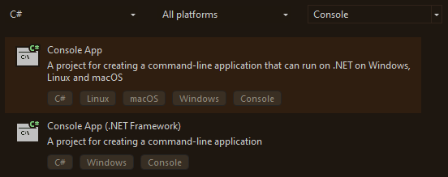
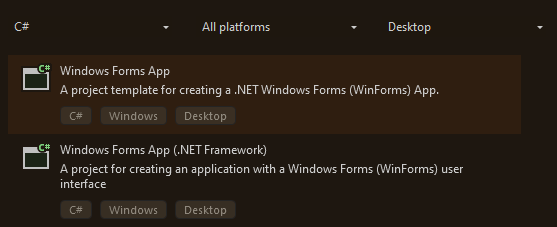
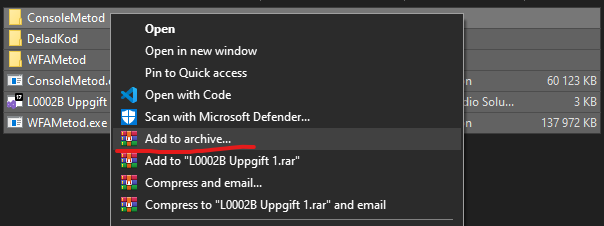

# Operationer och mattematik
Denna uppgift går över operationer och mattematik.

Du kommer behöva skapa denna uppgift som både en Console application:<br>
<br>
Samt som en Windows Forms App:<br>
<br>

Du kan använda dig av .NET Framework eller ej, spelar ingen stor roll.

## Uppgiften
Ni ska skapa en applikation som tar in 2 nummer, "Pris" och "Betalning", sedan ska den ge tillbaka växel.

Dvs i svenska sedlar `(500, 200, 100, 50, 20 lappar)` samt mynt `(10, 5, 1 kronor)`

Exempel på anget data och förväntat resultat:
```
Ange pris: 152      (Här skriver användaren in priset)
Betalt: 500         (Hur mycket kunden betalt)
Växel tillbaka:
1 tvåhundralapp
1 hundralapp
2 tjugor
1 femkrona
3 enkronor
```

Testa erat program innan ni lämmnar in!

## Några små tipps
- Skapa klasser som kan hjälpa er med att hantera värderna
```cs
class MinKlass {
    // Klass värden
    int värde;

    // Klass konstruktör
    public MinKlass(int nummer) {
        värde = nummer;
    }

    // Klass funktion
    public int GeVärdet() {
        return värde;
    }
}
```
- Det går att ge värden och modifiera värden efter definering
```cs
int mitt_nummer;

mitt_nummer = 50; // Är nu 50
```
- Compound operatörer är extremt användbara för att minimera koden
```cs
int mitt_nummer = 50;

mitt_nummer *= 3; // Är nu 150 eftersom att vi multiplicerade värdet med 3
```
- Bryt ut repetativ kod i funktioner
```cs
public string RepetativOperationer(int in_värde) {
    if (in_värde > 0) {
        return "Större än 0";
    }
    return "Mindre eller lika med 0";
}

// Tänk som att detta behöver kollas flera gånger om i din kod.
Console.WriteLine(RepetativOperationer(25));
Console.WriteLine(RepetativOperationer(43));
Console.WriteLine(RepetativOperationer(-125));
Console.WriteLine(RepetativOperationer(263));
Console.WriteLine(RepetativOperationer(0));
Console.WriteLine(RepetativOperationer(53));
Console.WriteLine(RepetativOperationer(-189));
```
## Inlämmning
Ni ska ta och zippa ihop erat projekt

För att göra det genom WinRar så välj filerna du vill zippa upp, och sedan följ dessa bilder:<br>
<br>
Sedan <br>
<br>
