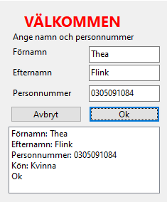

# Klass metoder och data validering
I denna uppgift kommer ni att använda er av en klass, samt metoder på klassen för att hantera/validera datan som matas in.

För denna uppgift kommer ni bara att använda Windows Forms: <br>
 <br>

## Uppgiften
Ni ska skapa en applikation som tar in 3 värden, och sedan bearbetar infomationen, värdena är "Förnamn", "Efternamn" och "Personnummer"

All information `måste` vara bevarad i en klass.

Ni kommer sedan att köra en Kontroll på Personnummer genom antingen 21-algoritm eller kontrollsiffran.

Sedan ska ni använda personnummer för att beräkna om det är en man eller kvinna.

Här ser ni ungefär hur det ska se ut <br>
  <br>

Men va kreativa, gör det snyggt!

## Några bra tipps
- En klass variable kan ha en getter och setter, och de kan vara definerade som en funktion istället
```cs
class MinKlass {
    private string Text;
    // Tar ut första karaktären från Text
    public char? FörstaKaraktär {
        // Detta är en getter
        get {
            if (string.IsNullOrEmpty(Text)) {
                return null;
            }
            return Text[0];
        }
        // Detta är en setter
        set {
            if (string.IsNullOrEmpty(Text)) {
                return;
            }
            Text[0] = value;
        }
        // Man behöver ej definera en setter, om man inte vill skriva någon data med den referencen.
    }
}
```
- Att verifiera längden av en string är extremt lätt!
```cs
string MinText = "Hejsan!";

// Om längden av MinText är längre eller lika med 5 så skriver vi Tjenare!
if (MinText.Length >= 5) {
    Console.WriteLine("Tjenare!");
}
```
- Du kan iterera över en string
```cs
string MinText = "Hello!";

foreach (char c in MinText) {
    Console.WriteLine(c);
}
```

## Inlämmning
Ni ska ta och zippa ihop erat projekt

För att göra det genom WinRar så välj filerna du vill zippa upp, och sedan följ dessa bilder: <br>
 <br>
Sedan <br>
 <br>